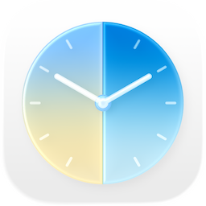

  

  # Timo

  ### Your world, at a glance.

  A world clock and time zone app for iPhone.

  

  [Website](https://trytimo.com) &nbsp;·&nbsp; [Privacy Policy](https://trytimo.com/privacy) &nbsp;·&nbsp; [Report an issue](../../issues)

---

## What is Timo?

Timo shows the local time in the cities you care about, side by side, with the time difference already worked out. No mental math, no flat alphabetical list to scroll through to find the one city you actually need. It's a native iPhone app that pairs cities together, colors each one by time of day so you can tell who's awake at a glance, and keeps it all one tap away on your Home Screen, Lock Screen, and Control Center.

## Features

- **World clocks, side by side.** Track your cities with large, easy-to-read clocks, the time difference is just there, no arithmetic required.
- **Time zone converter.** Tap any pair and drag the dial, or jump to a date, to see the time difference at any moment. Convert one pair, or shift your whole board at once.
- **Time-of-day colors.** Each card flows smoothly through dawn, day, dusk, and night as the hour changes, so the time *feels* right, not just reads right.
- **Groups.** Organize cities into custom sections like Work, Family, or Travel as your list grows.
- **Smart city search.** Type a city, or tap "Use my location," Timo handles the time zone for you.
- **Home Screen & Lock Screen widgets.** Both cities, their local times, day phases, and the hour difference, right where you look.
- **Control Center shortcut.** Jump straight to adding a city pair from Control Center or the Action button.
- **Works offline.** City pairs are stored on-device and sync privately via iCloud once added.
- **No ads, no accounts.** Nothing to sign up for, nothing watching you.

## Support Timo

Timo is completely free. No feature is gated behind a paywall. If you'd like to say thanks, there's an optional "Buy me a coffee" tip jar.

A tip just hides a small in-app promo banner for [journeybot][https://github.com/mferak/journeybot-app] as a thank-you, nothing else changes.

## Privacy, by design

- No accounts, no advertising SDK, no third-party trackers.
- Location, when you use it, is processed on-device through Apple's frameworks and isn't sent to us.
- Timo uses [TelemetryDeck](https://telemetrydeck.com) for anonymous, aggregate analytics, no personal data ever leaves your device.
- Full details in the [Privacy Policy](https://trytimo.com/privacy).

## Get Timo

Timo is available worldwide on the App Store for iPhone.

**[Download on the App Store →](https://apps.apple.com/us/app/world-clock-time-zones-timo/id6762064286)**

## Feedback, bugs, and ideas

This repository doesn't hold Timo's source. It exists to track feedback from people using the app.

- Found something broken? [Open a bug report](../../issues/new?template=bug_report.yml).
- Have an idea for a feature? [Open a feature request](../../issues/new?template=feature_request.yml).
- Press, support, or anything else: [timo@loam.sk](mailto:timo@loam.sk).

---

© 2026 Michal Ferák. Timo is a trademark of Michal Ferák. All rights reserved.

